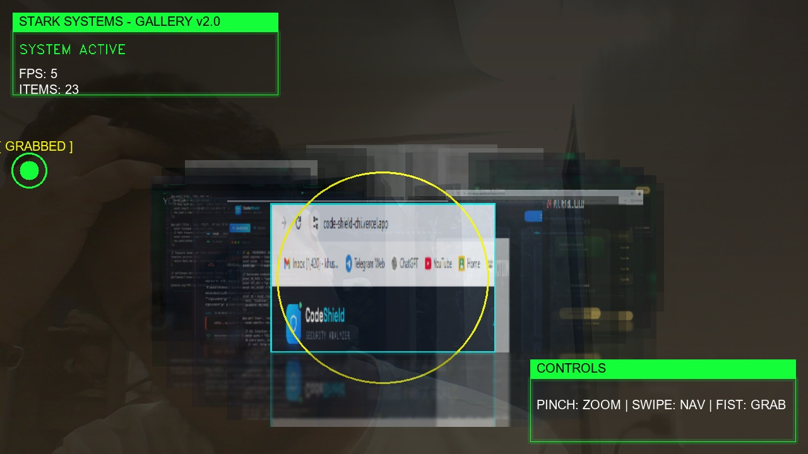

# NeuroGallery: Cinematic 3D Interactive HUD
> **Developed by Khushant15**

A production-level, gesture-controlled 3D gallery system built with Python, OpenCV, and MediaPipe. Experience a seamless, sci-fi inspired interface that brings your image collection to life through intuitive hand gestures.

[](screenshots)
> [!TIP]
> **View more high-resolution previews in the [screenshots/](screenshots) folder.**

## 🚀 Vision
NeuroGallery is designed to provide a premium, immersive experience for browsing images. Leveraging advanced computer vision, it translates your physical hand movements into cinematic 3D animations and UI interactions.

---

## ✨ Features
- **Cinematic 3D Carousel**: Infinite scrolling with depth-aware blurring, reflections, and shadows.
- **Glassmorphism UI**: Semi-transparent HUD panels with real-time background blur and neon glows.
- **Gesture Engine**: 
  - **Pinch**: Zoom and scale the gallery.
  - **Swipe**: Navigate between items (Left/Right).
  - **Fist**: "Grab" and manually rotate the carousel.
  - **Thumbs Up**: Hold to capture a high-quality screenshot.
- **Production Ready**: Dynamic resolution detection, 30 FPS cap, and modular clean-code architecture.

---

## 🛠️ Setup & Installation

### 1. Requirements
Ensure you have Python 3.10+ installed. Then, install the dependencies:
```bash
pip install opencv-python mediapipe numpy Pillow
```

### 2. Prepare Your Gallery
> [!IMPORTANT]
> **You must create a folder named `gallery` in the project root directory.** 
> Add your `.jpg` or `.png` images into this folder. NeuroGallery will automatically load and cache them for the 3D performance.

### 3. Run the App
```bash
python main.py
```

---

## 🎮 Controls

| Action | Gesture | Keyboard |
| :--- | :--- | :--- |
| **Rotate** | Swipe (L/R) or Fist Grab | `A` / `D` or Arrows |
| **Zoom** | Pinch (Index + Thumb) | N/A |
| **Screenshot** | Thumbs Up (Hold 1s) | N/A |
| **Fullscreen** | N/A | `F` |
| **Exit** | N/A | `ESC` |

---

## 📂 Project Structure
- `main.py`: Application entry point and state orchestration.
- `gesture.py`: MediaPipe-powered gesture recognition engine.
- `ui.py`: Glassmorphism and Neon HUD rendering.
- `gallery.py`: 3D Carousel math and reflection logic.
- `utils.py`: Common utilities and cinematic gradient generation.

---
*Created with ❤️ by Khushant15*
